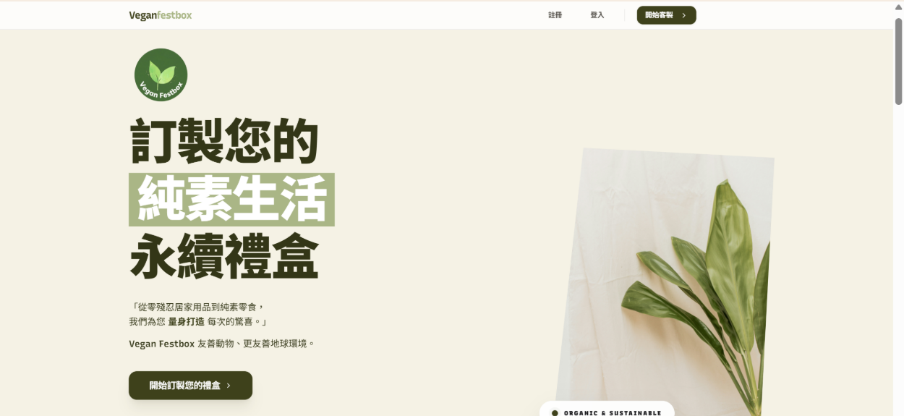
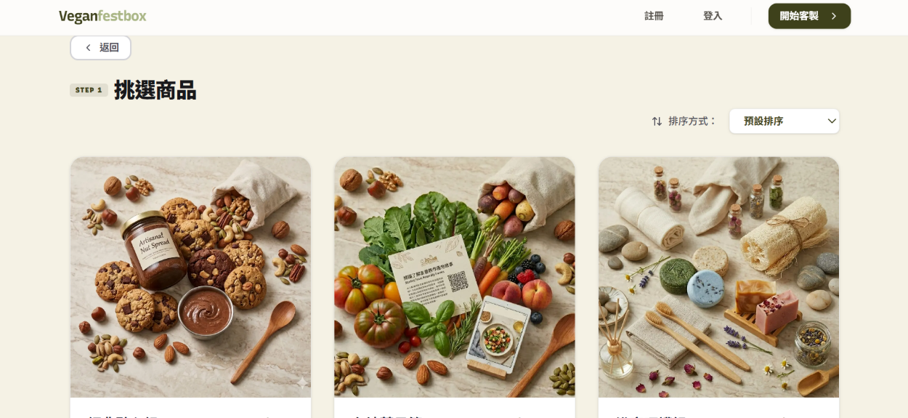
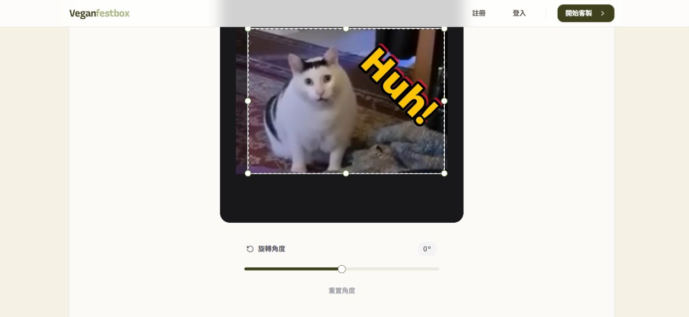
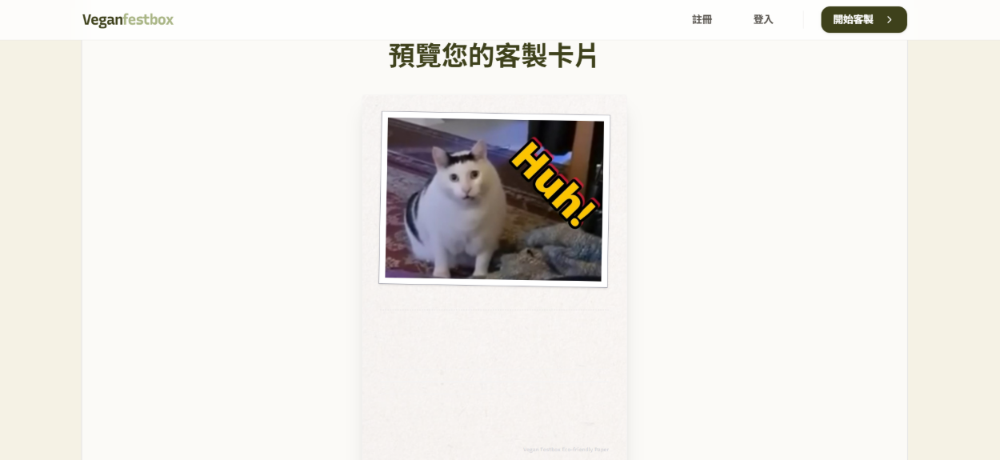
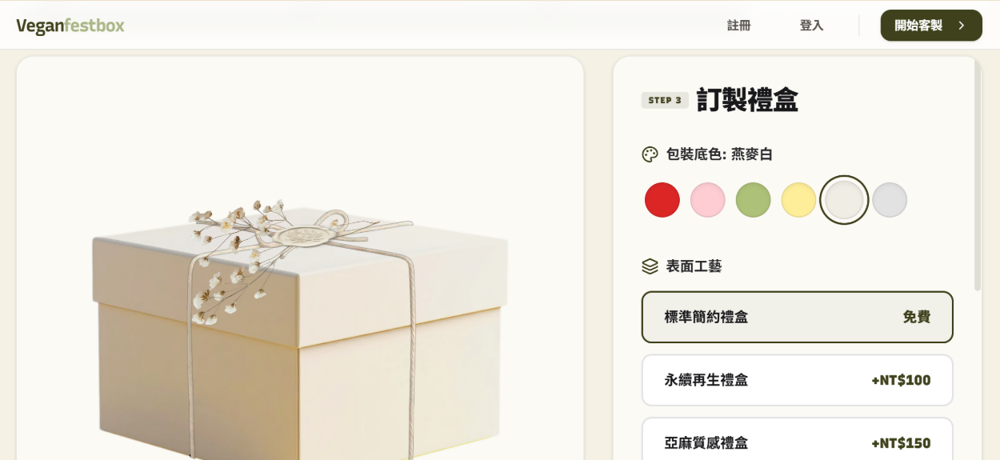
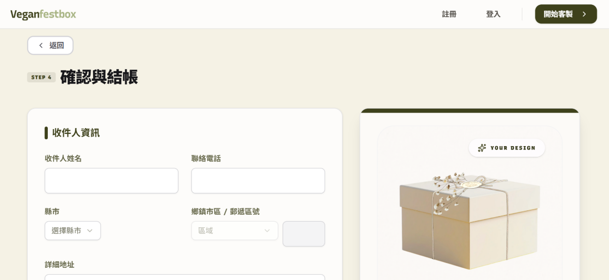
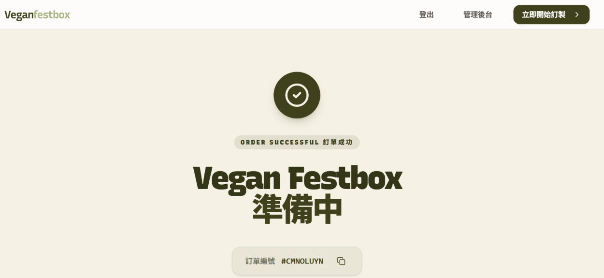
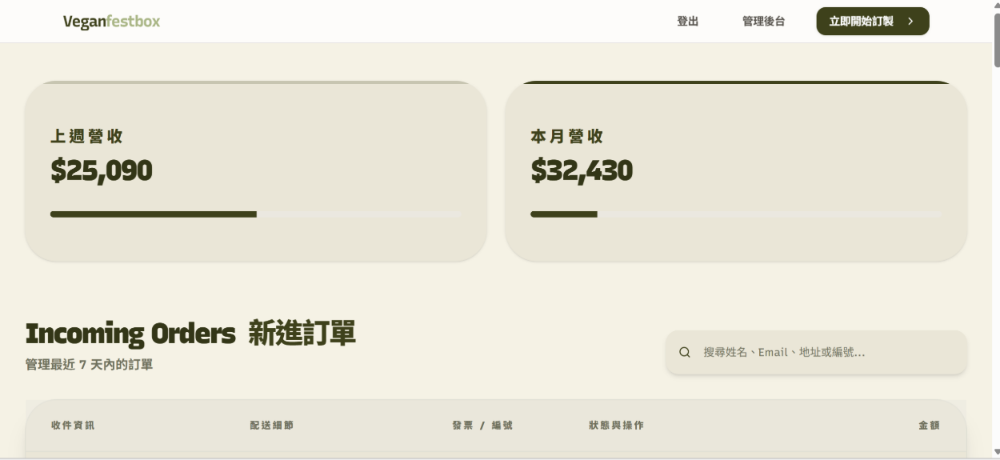

# 🌱 Vegan Festbox - 純素訂製禮盒平台

這個專案的初衷是想結合我對 **Vegan (純素)** 生活的推廣與技術實作。專案架構參考了 **Josh tried coding** 的 **CaseCobra**，這是一個基於 **Next.js 14** 打造的電商專案，目的是為用戶提供 Vegan 客製禮盒的服務。

## 📸 產品功能展示 (Product Walkthrough)

實作了從挑選方案到管理後台的完整閉環，以下為核心流程展示：

<table>
  <tr>
    <td align="center"><b>1. 品牌首頁 (Hero)</b></td>
    <td align="center"><b>2. 挑選方案 (Step 1)</b></td>
  </tr>
  <tr>
    <td></td>
    <td></td>
  </tr>
  <tr>
    <td align="center"><b>3. 客製照片上傳 (Step 2)</b></td>
    <td align="center"><b>4. 預覽小卡效果 (Step 2)</b></td>
  </tr>
  <tr>
    <td></td>
    <td></td>
  </tr>
  <tr>
    <td align="center"><b>5. 禮盒外觀配置 (Step 3)</b></td>
    <td align="center"><b>6. 確認與結帳 (Step 4)</b></td>
  </tr>
  <tr>
    <td></td>
    <td></td>
  </tr>
  <tr>
    <td align="center"><b>7. 訂單確認 (ThankYou page)</b></td>
    <td align="center"><b>8. 管理後台 (Admin dashboard )</b></td>
  </tr>
  <tr>
    <td></td>
    <td></td>
  </tr>
</table>

## ✨ 實作功能 (Features)

### 🎁 禮盒選購邏輯實作

- **主題式分流**：設計預設的純素組合選單，模擬電商選購流程，減少使用者操作複雜度。

### 🖼️ 客製化配置流程

- **動態預覽配置器**：實作產品配置邏輯，使用者可即時預覽小卡上傳效果與禮盒配色，練習處理複雜的 UI 狀態同步。

### 📩 售後流程自動化

- **Resend API 整合**：串接第三方郵件服務，實作當訂單觸發後自動發送確認信的後端邏輯。
- **購物流程閉環**：完成從產品挑選、模擬結帳到成功頁面的導覽路徑，確保使用者操作路徑 (User Flow) 的完整性。

### 📱 技術架構與開發

- **Next.js 14 實踐**：運用 **App Router** 進行頁面路由規劃，並使用 **TypeScript** 提升程式碼的可維護性。
- **響應式佈局**：使用 **Tailwind CSS** 確保在行動裝置與桌面端皆能流暢操作。

## 🛠️ 技術棧 (Tech Stack)

- **Framework**: Next.js 14 (App Router)
- **Language**: TypeScript
- **Styling**: Tailwind CSS
- **Email Service**: Resend
- **Components**: Shadcn UI & Lucide Icons
- **Icons**: Lucide React
- **Deployment**: Vercel

## 🚀 快速開始 (Getting started)

若要在本地環境運行此專案，請執行以下步驟：

**Clone 專案：**

```bash
git clone https://github.com/pinchen-dev/vegan-festbox.git
```

**安裝與開發：**

```bash
npm install
npm run dev
```
