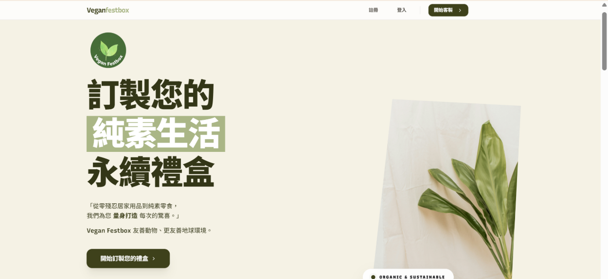
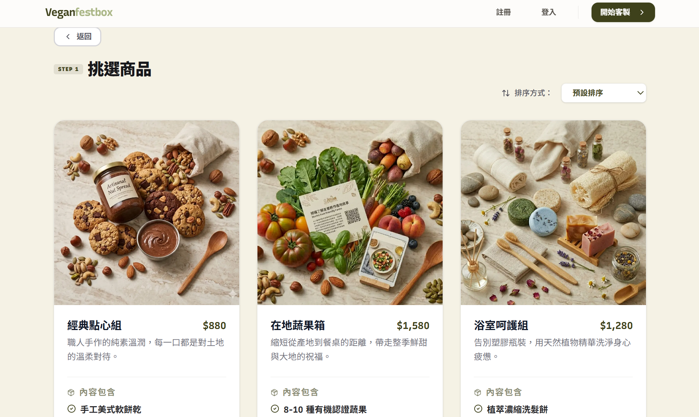
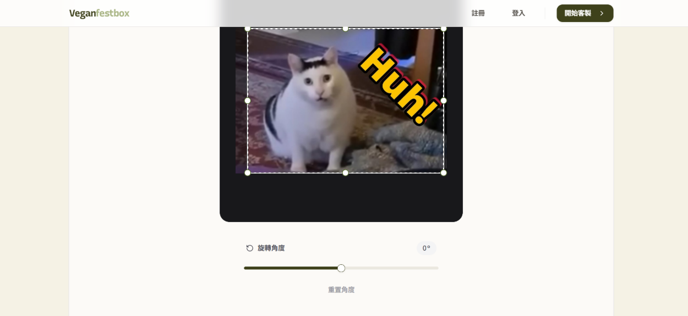
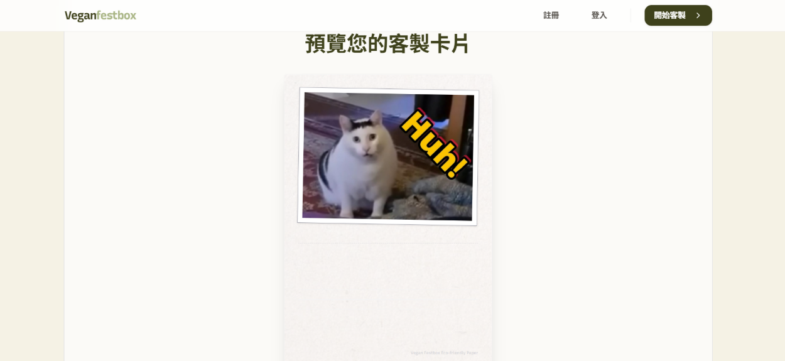
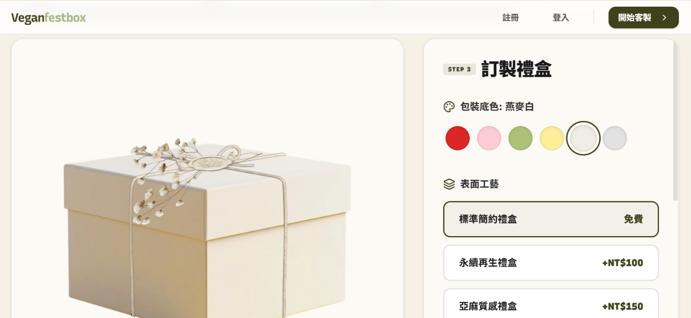
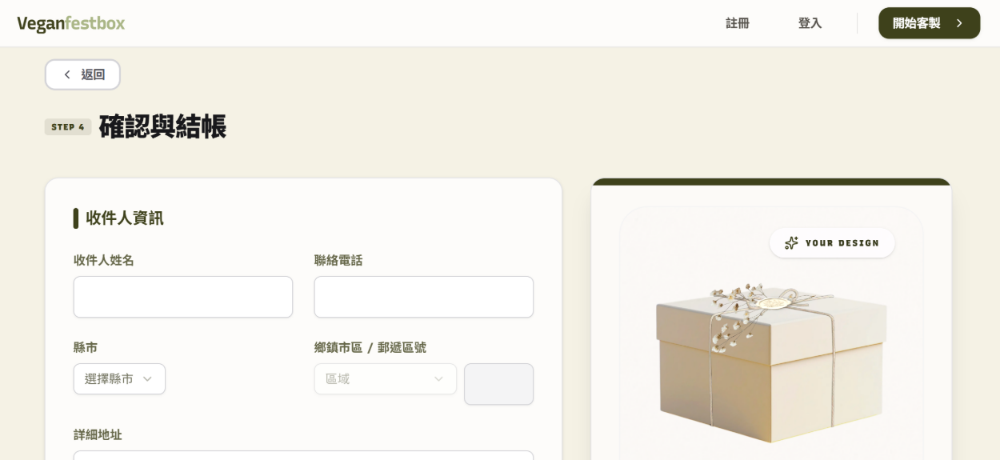
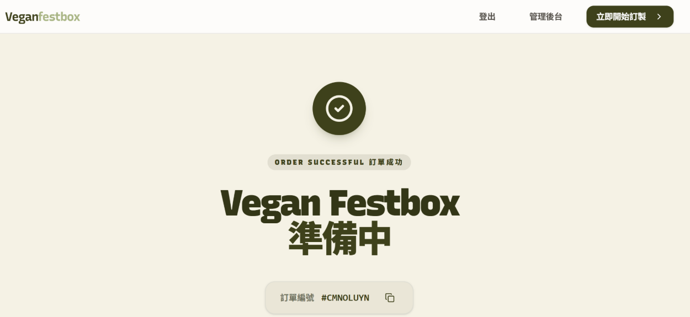
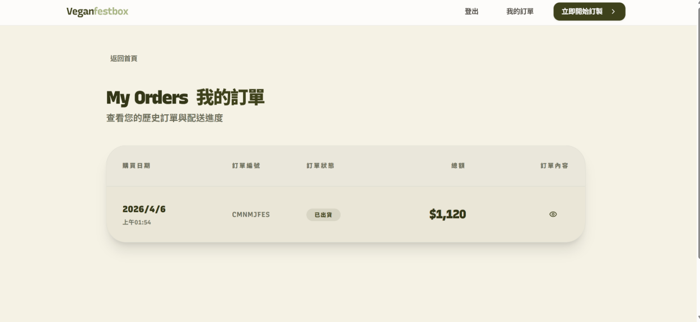
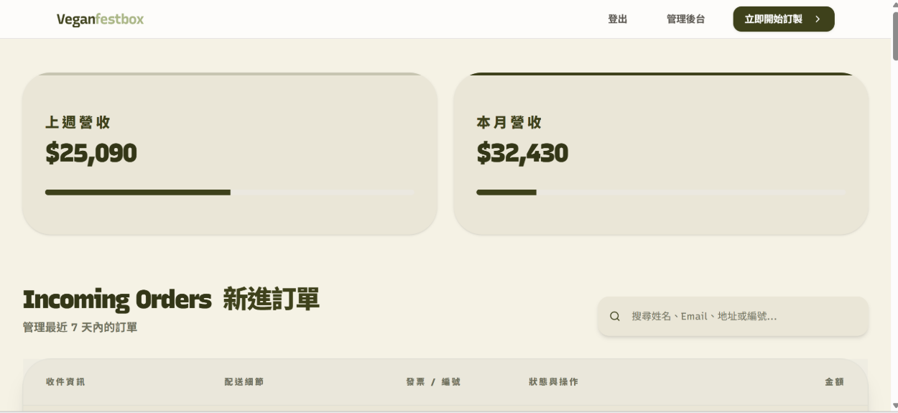

# 🌱 Vegan Festbox - 純素訂製禮盒平台

結合對純素生活的推廣理念與全端技術實作，打造支援客製化禮盒選購、即時預覽與完整訂單管理的電商平台。

> **Note:** 本專案核心架構參考自 CaseCobra 並進行自定義開發，在此基礎上導入了台灣在地化功能（電子發票邏輯、本土節慶場合）與完整的自動化測試覆蓋，以符合真實商業情境。

## 📸 產品功能展示 (Product Walkthrough)

實作了從挑選方案到管理後台的完整閉環，以下為核心流程展示：

<table>
  <tr>
    <td align="center"><b>1. 品牌首頁 (Hero)</b></td>
    <td align="center"><b>2. 方案挑選 (Step 1)</b></td>
    <td align="center"><b>3. 客製照片上傳 (Step 2)</b></td>
  </tr>
  <tr>
    <td></td>
    <td></td>
    <td></td>
  </tr>
  <tr>
    <td align="center"><b>4. 預覽小卡效果 (Step 2)</b></td>
    <td align="center"><b>5. 禮盒外觀配置 (Step 3)</b></td>
    <td align="center"><b>6. 確認與結帳 (Step 4)</b></td>
  </tr>
  <tr>
    <td></td>
    <td></td>
    <td></td>
  </tr>
  <tr>
    <td align="center"><b>7. 訂單確認 (Thank You)</b></td>
    <td align="center"><b>✨ 使用者訂單 (My Orders)</b></td>
    <td align="center"><b>🛡️ 管理後台 (Admin)</b></td>
  </tr>
  <tr>
    <td></td>
    <td></td>
    <td></td>
  </tr>
</table>

## ✨ 實作功能 (Features)

### 🎁 禮盒選購邏輯實作

- **主題式分流**：設計預設的純素組合選單，模擬電商選購流程，減少使用者操作複雜度。

### 🖼️ 客製化配置流程

- **動態預覽配置器**：實作產品配置邏輯，使用者可即時預覽小卡上傳效果與禮盒配色，練習處理複雜的 UI 狀態同步。

### 📩 售後流程自動化

- **Resend API 整合**：串接第三方郵件服務，實作當訂單觸發後自動發送確認信的後端邏輯。
- **購物流程閉環**：完成從產品挑選、模擬結帳到成功頁面的導覽路徑，確保使用者操作路徑 (User Flow) 的完整性。

## 📱 技術架構與開發 (Technical Architecture)

- **Next.js 14 實踐**：運用 **App Router** 進行頁面路由規劃，並使用 **TypeScript** 提升程式碼的可維護性。
- **響應式佈局**：使用 **Tailwind CSS** 確保在行動裝置與桌面端皆能流暢操作。

## 🗄️ 資料庫設計 (Database Schema)

使用 **PostgreSQL** 與 **Prisma ORM** 進行開發，核心設計包含四張關聯資料表：

- **User**：儲存使用者基本資料與身分驗證資訊。
- **Configuration**：紀錄禮盒的客製化配置（顏色、材質、裝飾物），確保每個訂單的獨特性。
- **Order**：核心業務邏輯表，關聯 `User` 與 `Configuration`，並採用台灣發票模式（個人、統編、載具）。
- **ShippingAddress**：收件地址管理，與訂單採一對多關聯。

## 🧪 測試開發實務 (Testing Practice)

本專案整合了 Vitest 與 Playwright，確保核心邏輯與流程穩定。

* **端對端測試 (Playwright)**：
    * 模擬完整購物流（選品 ➔ 登入 ➔ 結帳）。
    * **自動化後台操作**：模擬管理員切換訂單狀態（如：處理中 ➔ 已出貨），並驗證數據同步。
* **單元測試 (Vitest)**：
    * `InvoiceSchema` 驗證邏輯：處理全形轉半形、載具格式與統編校驗。
* **穩定性優化**：針對下拉選單等非同步組件，導入 `dispatchEvent` 與等待機制，解決測試不穩定的問題。

## 🛠️ 技術棧 (Tech Stack)

- **Framework**: Next.js 14 (App Router)
- **Language**: TypeScript
- **Database**: PostgreSQL (Neon) via Prisma
- **Auth**: Kinde Auth
- **Styling**: Tailwind CSS & Shadcn UI
- **Email Service**: Resend
- **Components**: Shadcn UI & Lucide Icons
- **Icons**: Lucide React
- **Testing**: Vitest & Playwright
- **Deployment**: Vercel

## 🚀 快速開始 (Getting started)

若要在本地環境運行此專案，請執行以下步驟：

**Clone 專案：**

```bash
git clone https://github.com/pinchen-dev/vegan-festbox.git
```

**安裝與開發：**

```bash
npm install
npm run dev
```
